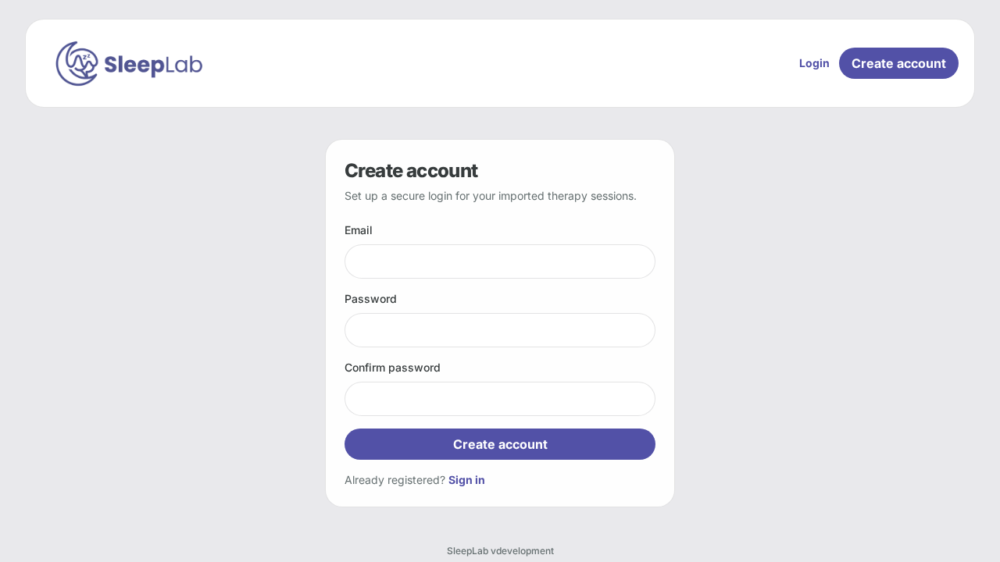
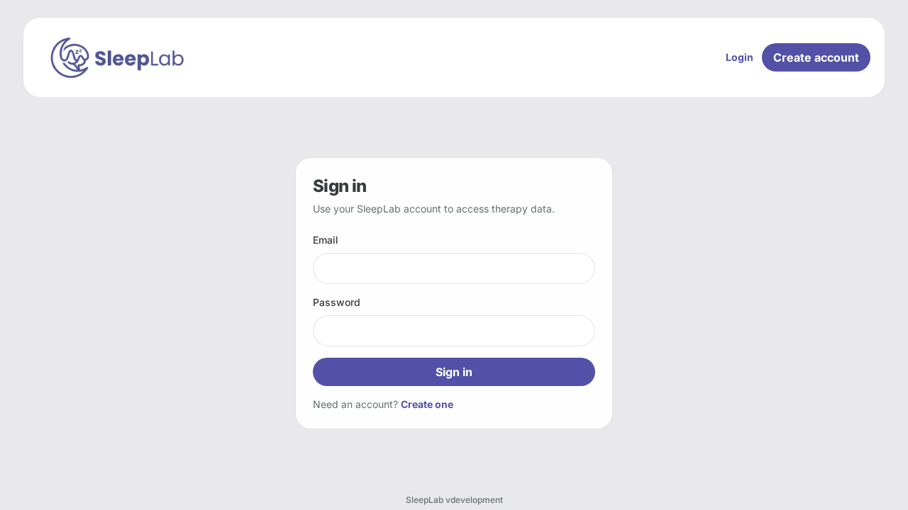
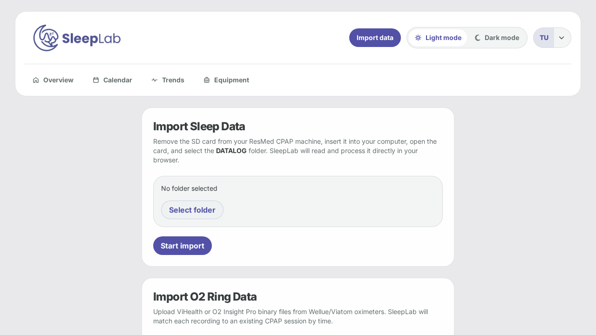
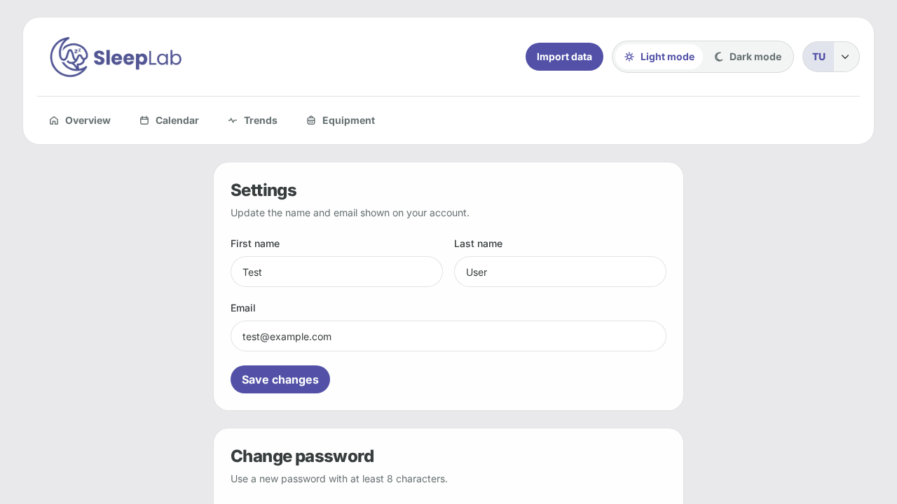

# UI Overview

A visual walkthrough of SleepLab's interface, organised by workflow. Screenshots are captured automatically via `make docs-capture` and committed under `docs/public/ui-snapshots/`.

---

## Registration & Login

SleepLab is a self-hosted, single-user application. Authentication is local — credentials are stored in Postgres and never leave your instance.

### Create account

The registration screen collects an email address, password, and password confirmation. A minimum password length is enforced server-side. Once submitted, the account is created immediately and the user is redirected to the dashboard.

The header bar already shows the **Login** link and **Create account** button so first-time visitors can orient themselves without being authenticated. Registration can be disabled entirely via the `REGISTRATION_ENABLED` environment variable for deployments where a single account has already been set up.

### Sign in

The sign-in form accepts the email and password set during registration. On success a JWT is stored in `localStorage` and the user lands on the Overview page. The **Create one** link at the bottom navigates to the registration screen; this link is hidden when registration is disabled.

All protected routes check the stored token on every request via the `useAuth` hook. An expired or invalid token clears the stored credential and redirects to `/login` automatically.

---

## Importing Data

SleepLab supports three independent import paths that can be used in any combination. All imports are idempotent — re-importing the same data never creates duplicates.

### DATALOG folder upload

The primary import method reads EDF files directly from a ResMed SD card:

1. Remove the SD card from your machine and insert it into your computer.
2. Click **Select folder** and choose the `DATALOG` directory at the root of the card. The browser enumerates all `.edf` files recursively — no files are sent until you confirm.
3. Click **Start import**. Files are batched in groups of 200 and uploaded sequentially; a progress bar tracks completion. The backend queues an import job that parses each session block in the background.
4. A status indicator in the header polls the job state and turns green once the import finishes. New sessions appear in the Overview immediately.

The importer reads four EDF channel types per night: `CSL` (device log), `PLD` (2-second metrics), `EVE` (respiratory events), and optionally `BRP` (breath waveform) and `SA2`/`SAD` (SpO2). Each night may contain multiple session blocks; the importer pairs them by timestamp and merges their metrics into a single row per block.

### O2 Ring / pulse oximeter upload

The oximeter section (below the DATALOG form) accepts `.bin` or `.dat` binary files from Wellue and Viatom pulse oximeters (ViHealth, O2 Insight Pro). SleepLab matches each recording to an existing CPAP session by date, then stores SpO2 and pulse time-series alongside the CPAP metrics.

The import result card shows per-file outcomes grouped by status:

- **Imported** — recording matched a session and SpO2/pulse data were written
- **Skipped** — session already had SpO2 data and overwrite was not requested
- **Unmatched** — no CPAP session exists for the recording date
- **Failed** — the binary file could not be parsed

### SleepHQ sync

Users who upload their CPAP data to [SleepHQ](https://sleephq.com) can pull sessions directly from the SleepHQ API. After adding SleepHQ credentials in Settings, the **Sync SleepHQ** button triggers a full history pull with automatic rate-limit back-off between batches. Sessions are stored with a `sleephq-{record_id}` identifier to avoid collisions with locally-imported sessions.

### Local server import

Deployments running SleepLab on a home server with the SD card permanently mounted can configure a `LOCAL_DATALOG_PATH`. The **Run local import** button triggers an in-process import from that path without any file upload. The last-run timestamp and status are displayed alongside the button.

---

## Dashboard

The Overview page is the primary landing page after login. It aggregates every imported night into a single, scannable summary.

### Compliance summary strip

The top row shows three headline numbers for the selected date range (default: last 30 nights):

- **Total nights** with recorded data
- **Compliance %** — proportion of nights at or above 4 hours of use, the standard Medicare threshold
- **Average AHI** — mean Apnea–Hypopnea Index across all nights in range

Nights with less than 4 hours of use are highlighted in the compliance breakdown so short-use nights are easy to identify without digging into individual sessions.

### Calendar heatmap

The heatmap provides an at-a-glance month-by-month view of therapy quality. Each cell represents one night; colour encodes the selected metric:

| Metric | Green | Yellow | Orange | Red |
|--------|-------|--------|--------|-----|
| **AHI** | < 5 (normal) | 5–15 (mild) | 15–30 (moderate) | ≥ 30 (severe) |
| **Usage** | ≥ 6 h | 4–6 h | < 4 h | — |
| **Leak** | < 24 L/min | 24–40 L/min | > 40 L/min | — |

A toggle in the card header switches between AHI, usage, and leak modes. Clicking any cell navigates directly to that night's Session Detail page. A month picker lets you jump to any point in your history without scrolling.

### AHI trend chart

A 90-night line chart with an interactive metric selector (AHI / Leak / Pressure). A dashed green reference line marks the AHI = 5 therapy-control threshold. Nights where the selected metric was flagged are rendered as coloured dots (red for high concern, orange for watch). Clicking any point navigates to that session.

### Flagged nights panel

Nights that breach configurable thresholds appear in a condensed alert list with a brief label (e.g. *AHI 18.4 — moderate*). Thresholds are set per-metric in Settings and default to clinical guideline values.

### AI insights card

When an OpenAI-compatible LLM endpoint is configured, the AI card generates a plain-English summary of the last 30 nights, structured into three columns:

- **Observed** — high-confidence patterns with strong data support
- **Possible** — patterns that warrant attention but need more data
- **Review** — actionable things to discuss with a clinician

The summary is cached per-user until manually refreshed. A disclaimer is always shown below the analysis reminding users that the output is not medical advice.

### PDF report export

The **Export PDF** button produces a printable therapy report for a selectable date range. The report includes the 30-night AHI trend chart, compliance metrics, and a per-night table. It is generated server-side with ReportLab and streamed directly to the browser.

---

## Analytical Tools

### Session Detail

Each night's session is accessible via the calendar heatmap, the trend chart, or the session list. The detail page is the deepest level of analysis in SleepLab.

#### Night badge and therapy score

At the top of the page a coloured badge classifies the night:

| Badge | Score range |
|-------|------------|
| Good night | ≥ 90 |
| Mild night | 80–89 |
| Rough night | 70–79 |
| Difficult night | < 70 |

Below the badge, a score card breaks the 0–100 therapy score into four weighted components. Each component shows its earned points, maximum, and the underlying metric value:

- **AHI (40 pts)** — non-linear penalty above 5 events/hour; full credit at or below 5
- **Large leak (25 pts)** — linear decay from the manufacturer's large-leak threshold to zero at 2.5×; only scored for ResMed devices where a threshold is known
- **Usage duration (20 pts)** — full credit at ≥ 7 h, zero below 2 h, linear between
- **SpO2 (15 pts)** — derived from average SpO2 plus a hard cap when minimum SpO2 drops below 88% or 85%

Missing components (e.g. no oximeter data) have their weight redistributed to present components so the total always reaches 100. A human-readable callout sentence names the biggest drag on tonight's score.

#### Key metrics grid

A compact grid shows the session's primary numbers: AHI, average pressure, 95th-percentile pressure, average leak, usage duration, therapy mode, and mask type. Masked device serial (last 5 digits) is shown for identification.

#### Metrics time-series charts

Two synchronised recharts panels cover the full session at 2-second resolution. The left panel renders pressure, EPR pressure, and mask pressure on a single Y-axis. The right panel renders leak, respiration rate, tidal volume, and minute ventilation. Hovering either chart shows a tooltip with all values at that timestamp.

#### Respiratory event timeline

All `Central Apnea`, `Obstructive Apnea`, `Hypopnea`, `Apnea`, and `Arousal` events are plotted as coloured markers on a timeline aligned with the metrics charts. Clicking any event opens the **Event Inspector**, a zoomed window showing:

- The ±30/60/120-second waveform window around the event
- Neighbouring events in the same window
- High-frequency flow and pressure waveform traces from the BRP channel (where available)

#### SpO2 and pulse chart

When oximeter data is present, a third panel shows SpO2 (%) and pulse (bpm) plotted against session time. The Y-axis always starts at 80% to keep desaturation dips visually prominent.

#### Notes and tags

A free-text note field and a tag selector let users annotate each night. Tags are drawn from a fixed vocabulary (Travel, Alcohol, Sick, New mask, Mouth tape, Back sleeper, Bad sleep, Good sleep, Camping) and are used by the Insights page to compute AHI deltas. Notes and tags are written to all session blocks for the same calendar night.

#### Session navigation

Prev / Next chevrons at the top of the page step through sessions in chronological order without returning to the overview.

---

### Calendar page

The Calendar page renders a full year-at-a-glance heatmap using the same colour scheme as the Overview heatmap. Each month is a compact 7-column grid. The metric toggle (AHI / Usage / Leak) and a legend are fixed in the header. Clicking any coloured cell navigates to that night's Session Detail.

An empty-state message guides new users to the Import page when no sessions exist yet.

---

### Trends page

The Trends page focuses on longer-arc patterns over 90 nights. It combines:

- **Compliance and AHI summary** — headline compliance percentage, average AHI, average pressure, and total nights in the window
- **90-night trend chart** — the same switchable line chart from the Overview, with metric tabs for AHI, leak, and pressure
- **AI trend summary** — a separate LLM-generated analysis scoped to 90 nights, structured into observed patterns, possible patterns, and items to review. The summary includes a flag (🟢 Good / 🟡 Watch / 🔴 Alert) as a top-level signal

---

### Insights page

The Insights page computes **tag-based AHI deltas** — the difference between average AHI on tagged nights versus untagged baseline nights. For each tag that appears at least once in the history, a row shows:

- The tag name and night count
- Average AHI on those nights
- Baseline average AHI (untagged nights)
- Delta AHI (negative = tag correlates with better nights; positive = worse)

This lets users empirically test correlations like "my AHI is higher when I travel" or "back-sleeper nights are consistently worse" without relying on the AI summary.

---

### Equipment page

The Equipment page tracks CPAP accessories and their service life. Each item records:

- **Type** — cushion, headgear, tubing, humidifier chamber, or filter
- **Start date** — when the item was put into service
- **Replacement interval** — manufacturer-recommended days (editable)
- **Days in use** — calculated live relative to today
- **Mask category** — for cushions and headgear
- **Brand and model** — free text

Items within 7 days of their replacement interval are highlighted in amber; overdue items are highlighted in red. The Overview heatmap's Equipment Age column uses the active cushion's age in days as its data source.

---

## Settings

The Settings page is divided into four cards. Changes to each section are submitted independently.

### Profile

First name, last name, and email address. These are display fields only — changing email does not affect authentication until the next login.

### Change password

Current password plus new password (minimum 8 characters). The server validates the current password before accepting the change; a wrong current password returns a 400 with a clear error message.

### Import settings

| Field | Purpose |
|-------|---------|
| **Machine timezone** | IANA timezone string for the CPAP clock (e.g. `America/Chicago`). EDF timestamps are naive local time; this corrects them to UTC for storage. A mismatch here is the most common cause of sessions appearing at the wrong time. |
| **Local DATALOG path** | Absolute path on the server to a permanently-mounted SD card or NAS share. Used by the **Run local import** button on the Import page. |
| **SleepHQ client ID / secret** | OAuth credentials from your SleepHQ developer settings. Required for the **Sync SleepHQ** button. |
| **LLM base URL / API key** | OpenAI-compatible endpoint for AI summaries. Can point to a local Ollama instance or any OpenAI-compatible proxy. Leave blank to hide AI cards across the app. |

### Therapy score thresholds

Numeric thresholds that control when nights are flagged in the trend chart and session list. Defaults match clinical guideline values:

| Threshold | Default |
|-----------|---------|
| AHI watch | 5 events/hr |
| AHI alert | 15 events/hr |
| Large leak watch | 24 L/min |
| Large leak alert | 40 L/min |
| Minimum usage | 4 h |
